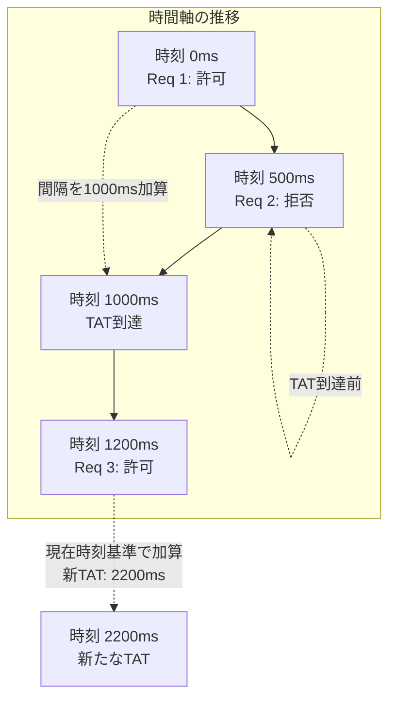

# beautyspot におけるレート制限アルゴリズム「GCRA」の採用

## 固定ウィンドウ方式における「境界線問題」

LLM（大規模言語モデル）の API を呼び出すアプリケーションを開発していると、必ず直面するのがレート制限（Rate Limit）の壁だ。

「1分間に60回まで」という制限に対し、素朴な「固定ウィンドウ（Fixed Window）」方式で実装すると、ある重大な問題が浮き彫りになる。
ウィンドウの切り替わりの瞬間（例：0分59秒と1分00秒）にリクエストが集中した場合、実質的な制限の2倍の負荷が極めて短時間に発生してしまう「境界線問題」だ。API側からは悪質なバーストトラフィックと見なされ、頻繁に `429 Too Many Requests` で跳ね返されることになる。

本記事では、ライブラリ `beautyspot` において、より厳密で滑らかな流量制御を実現するために採用したアルゴリズム **GCRA (Generic Cell Rate Algorithm)** の理論的な仕組みと、実装上の工夫を図解を交えて整理する。

## 1. なぜ「トークンバケット」ではなく「GCRA」なのか

レート制限の代表的な手法に「トークンバケット」がある。しかし、これをプログラムで堅牢に実装しようとすると、一定時間ごとにトークンを補充するバックグラウンドタイマーを稼働させるか、リクエストのたびに「前回の時刻」と「現在のトークン残量」という複数の状態を計算・同期し続ける必要がある。

一方で、ATM（Asynchronous Transfer Mode）通信などのネットワーク制御を起源とする GCRA は、**「次にリクエストを許可して良い理想的な時刻（TAT: Theoretical Arrival Time）」** という1つの状態（ポインタ）のみを保持するだけで、トークンバケットと同等の制御が可能になる。

* **ステートレスに近い簡潔さ:** データベースや共有メモリ（Redis等）に保存・同期すべき値が「時刻」一つで済む。
* **数学的な厳密さ:** リクエストの間隔を理想的な間隔に強制的に平準化できる。

## 2. 【図解】GCRAがリクエストの間隔を平準化するメカニズム

GCRAの挙動は、単なるエラー返却ではなく「パケットの到着予定時刻のスケジューリング」として捉えると理解しやすい。履歴の変遷を3つのフェーズに分けて図解する。

### フェーズ1：最初のリクエストとTATの設定

最初のリクエストが到達した際、GCRAは「次のリクエストが到達すべき理想的な間隔（Emission Interval）」を足し合わせ、**TAT（理論的到着時刻）** を未来に設定する。

### フェーズ2：TAT到達前のリクエスト（拒否）

設定されたTATよりも前に次のリクエストが到達した場合、GCRAはそれを「早すぎる（流量オーバー）」と判定し、リクエストを拒否する。

### フェーズ3：TAT経過後のリクエスト（許可と更新）

時間が経過し、TATを過ぎてからリクエストが到達した場合、リクエストは許可される。そして、**「現在の時刻」または「現在のTAT」の遅い方を基準にして**、新たなTATがさらに未来へと再設定される。



これを数式で表すと、新たなTATの算出は以下のように定義される（$t$ は現在時刻、$I$ は理想的な間隔を指す）。

$$TAT_{new} = \max(t, TAT) + I$$

このシンプルな仕組みにより、リクエストがどんなに集中しても、処理は必ず一定の間隔（$I$）に引き延ばされる。

## 3. 対処法：浮動小数点数を排除した「整数演算」

GCRA の計算式には「時間の経過」と「リクエストの間隔」が登場する。これを Python の `time.time()`（浮動小数点数）で計算しようとすると、累積する丸め誤差によって、長時間の運用で制限が微妙にずれるリスクがある。

`beautyspot` では、内部の時間をすべて **ナノ秒（Nanoseconds）単位の整数** として扱う設計をとった。

```python
import time

# 浮動小数点数を避け、整数として現在時刻を取得
now_ns = time.monotonic_ns()

# 1リクエストあたりの理想的な間隔（ナノ秒）
# 例: 1分間に60回なら 1,000,000,000 ns
emission_interval = (60 * 1_000_000_000) // rate_per_minute

# 次の許可時刻 (TAT) を更新
new_tat = max(tat, now_ns) + emission_interval

```

整数演算に徹することで、ナノ秒レベルでの正確なスケジューリングが可能になり、かつ分散環境で値を共有する際もシリアライズによる精度の損失が完全に排除される。

## 4. LLM開発における応用：「バースト容認量」とトークン制限

GCRAのもう一つの強力な概念が **「許容遅延量（Tolerance）」** だ。
これはトークンバケットにおける「バケットのサイズ」に相当し、一時的なリクエストの集中をどこまで許すかを決定するパラメータである。

現在時刻 $t$ が、TAT から Tolerance（$\tau$）を引いた時間よりも進んでいればリクエストを許容する、という論理だ。

$$t \ge TAT - \tau$$

* **Tolerance が小さい:** 常に一定の間隔でしかリクエストを許さない。非常に「硬い」制限。
* **Tolerance が大きい:** 短時間の集中（バースト）を許すが、その後のリクエストは長い間待たされる。

`beautyspot` では、ユーザーがこのバランスを直感的に調整できるようにしつつ、制限に抵触した際に「あと何秒待てば実行可能か（$TAT - t$）」を正確に算出できるインターフェースを提供している。これにより、ただエラーを投げるのではなく、適切な `sleep` を挟んで自律的に流量を調整する「賢いクライアント」の実装が容易になった。

さらに、このアルゴリズムは「回数」だけでなく「トークン数制限」にも応用可能だ。リクエストごとに消費するトークン量に応じて Emission Interval を動的に乗算することで、「長いプロンプトの後は自然に長い冷却期間が置かれ、短いプロンプトなら連続して送れる」という動的な制御が最小限のコードで実現できる。

## まとめ

API 制限を制御するために、GCRAアルゴリズムは極めて合理的なアプローチである。

* 固定ウィンドウ方式で発生する「境界線問題」による予期せぬバーストを回避できる。
* **GCRA** を採用することで、TAT（理論的到着時刻）という単一の状態管理だけで滑らかな流量制御が実現する。
* **ナノ秒単位の整数演算** を用いることで、時間の経過による浮動小数点数の丸め誤差を防ぎ、精度と移植性を確保する。
* 許容遅延量（Tolerance）と動的な間隔調整により、LLMのトークン消費量に合わせた柔軟な制御が可能になる。

「制限されるまで叩く」のではなく「制限を超えないように流す」。この制御が、LLM アプリケーションのユーザー体験を決定づける。

---

*License: MIT | Developed by Neel Bauman*
