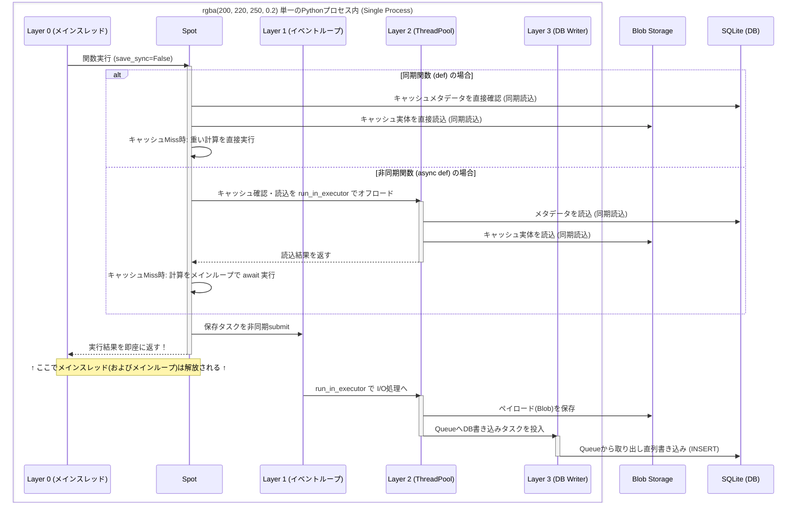
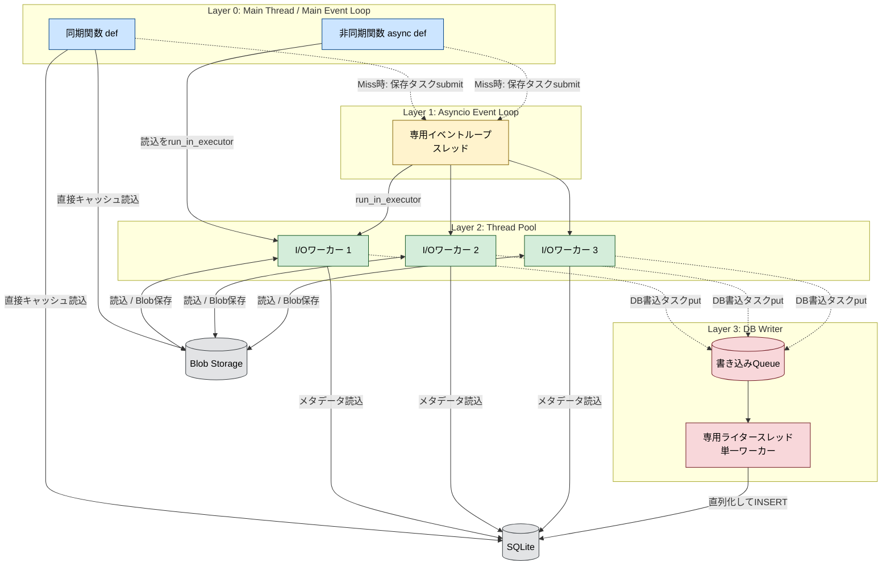
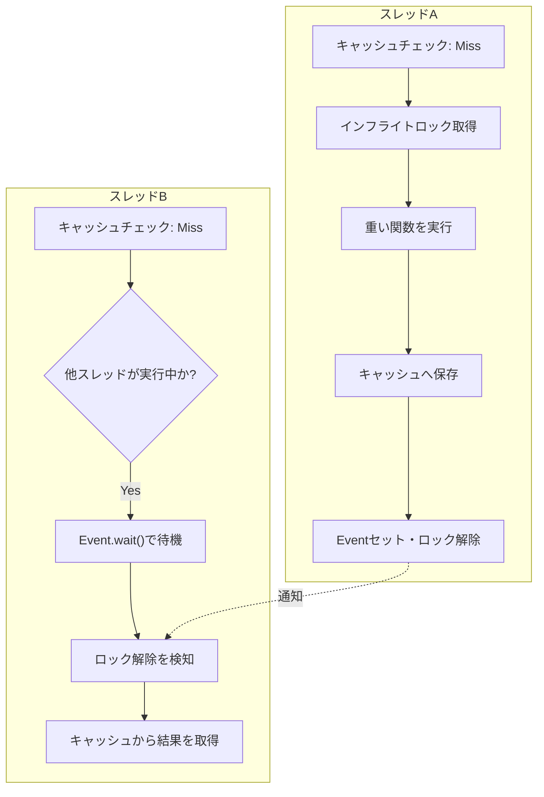
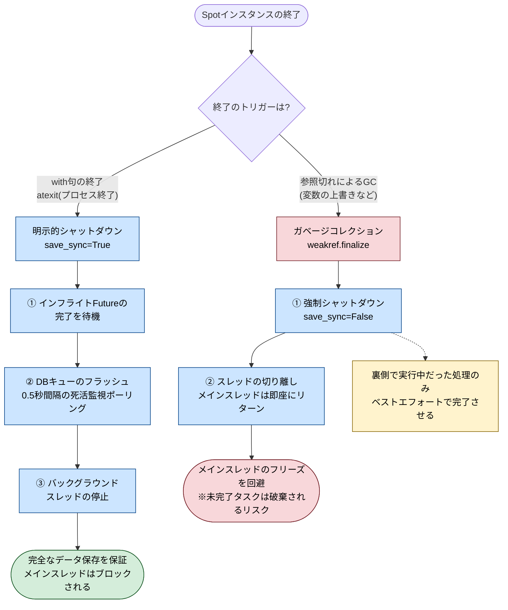

# Pythonのキャッシュ保存でメインスレッドを止めないための3層非同期アーキテクチャ

## キャッシュ保存によるメインスレッドのブロック

データサイエンスのパイプラインやLLMを活用したアプリケーションにおいて、料金がかかったり処理が重かったりする関数の実行結果をキャッシュ（永続化）するケースは多い。

しかし、巨大なデータフレームのシリアライズや、クラウドストレージ（S3など）へのアップロードを同期的に行うと、キャッシュの保存処理自体がボトルネックとなり、メインスレッドの実行（APIのレスポンスなど）を著しくブロックしてしまう。

OSSのキャッシュライブラリである `beautyspot` では、計算が完了した瞬間に結果を呼び出し元へ返し、裏側でデータを保存する「ノンブロッキング永続化（`save_sync=False`）」を採用している。
本記事では、単純なマルチスレッド化では解決できないデータベースの制約と、それを乗り越えるための3層非同期アーキテクチャの内部機構について、図解を交えて整理する。

## 1. ノンブロッキング永続化を支える3層構造

バックグラウンドで処理を行う際、直感的には `ThreadPoolExecutor` にタスクを投げる（`submit`）だけで済むように思える。しかし、`beautyspot` は以下の3つのレイヤーで非同期処理を分離している。

1. **Layer 1: 専用スレッド上の `asyncio` イベントループ**
2. **Layer 2: I/Oバウンド用の `ThreadPoolExecutor`**
3. **Layer 3: DB書き込み専用スレッドと直列化キュー**

> **補足: すべて単一プロセスで完結**
> 本アーキテクチャは、RedisやCeleryのような外部のワーカープロセスを立ち上げるものではなく、**すべて単一のPythonプロセス内のマルチスレッド**として動作する。プロセスのシリアライズや通信オーバーヘッドがゼロである反面、PythonのGIL（グローバルインタプリタロック）やSQLiteのファイルロックとどう協調するかが設計の鍵となる。

このアーキテクチャの「時間的な処理の流れ（シーケンス）」と「空間的な構造（フロー）」を対応させた図が以下の2つである。

### 時間軸で見る処理の流れ（シーケンス図）

非同期環境下では徹底してメインループをブロックしないよう、キャッシュ確認（DBやStorageからの読込）のI/Oすらもスレッドプールに逃がす工夫が組み込まれている。



### 空間的なアーキテクチャ構造（フローチャート）



## 2. なぜ単純なスレッドプールでは駄目なのか（SQLiteのロック問題）

asyncio のイベントループは、シングルスレッド上で協調的にタスクを切り替えることで非同期処理を実現している。
しかし、beautyspot が扱う巨大なデータフレームのシリアライズ（CPUバウンド）や、ローカルファイルシステム・S3等へのBlob保存（同期的なI/Oバウンド）は、標準ではブロッキング処理である。
もしこれをイベントループ上で直接実行してしまうと、その重い処理が終わるまでの間、イベントループ全体がフリーズしてしまう。

イベントループがフリーズするとどうなるかというと、メインスレッド（ユーザーのアプリケーション）が新しく bg_loop.submit(保存タスク) を呼ぼうとした際、イベントループ側がそのタスクをスケジュールする処理すら滞ってしまう可能性がある。
イベントループはあくまで「超軽量なタスクの受付係兼オーケストレーター」として常に即答できる状態（ノンブロッキング）を保っておく必要がある。

シリアライズやBlobストレージへの保存は、複数スレッドで並列に実行しても問題ない（ `Layer 2` の役割）。

一方で、SQLiteへの書き込みは並列に行うと database is locked エラーになるため直列化が必要である（ `Layer 3` の役割）。
この仕様に起因して、 `Layer 3` に専用のライタースレッドとキュー（`queue.Queue`）が存在する。

SQLiteにおいてWAL（Write-Ahead Logging）モードを有効にしても、書き込み操作は本質的に単一のライターに制限される。そのため、`ThreadPoolExecutor` の複数ワーカーから同時に `INSERT` を試みると、高い確率で `database is locked` エラーが発生する。

この問題を回避するため、`beautyspot` ではコネクションプールを使用せず、**データベースへの書き込み操作そのものをキューイングし、単一のスレッドで直列化（シリアライズ）して実行**している。これにより、マルチスレッド環境下でもSQLiteの整合性を維持しつつ、メインスレッドやBlob保存の並行性を一切犠牲にしない設計となっている。

## 3. 同時キャッシュミス（Thundering Herd現象）とその対策

並行処理を導入したキャッシュシステムにおいて、もう一つ致命的となるのが「Thundering Herd」問題である。

キャッシュが有効期限切れになった直後、複数のスレッドが同時に同じ関数を呼び出すと、全員が「キャッシュミス」と判定して重い処理を一斉に実行してしまう。

`beautyspot` の内部では、この現象を防ぐためにキャッシュキーに基づく待機ロック機構（`_inflight`）を実装している。



最初に到達したスレッドだけが関数を実行し、後続のスレッドは `threading.Event().wait()` によって処理の完了をノンブロッキングで待機する。完了通知を受けた後続スレッドは、自ら計算を行うのではなく、先行スレッドが保存したキャッシュから結果を取得する。

## 4. 永久ハングを防ぐポーリングのフェイルセーフ設計

バックグラウンド処理を安全に終了させる際、キューに残っているタスクを全て消化するまで待機（ドレイン）する `flush()` 処理が必要になる。ここで初心者が陥りがちな罠が、単純に `Queue.join()` や無期限の `Event.wait(timeout=None)` を使ってしまうことだ。

もし待機中に、裏のワーカー（ライタースレッド）が予期せぬエラーやOSの都合で**突然死（クラッシュ）** してしまったら、完了通知（イベント）は永遠に発行されず、メインスレッドは無限にフリーズ（デッドロック）してしまう。

`beautyspot` では、この破滅的な事態を防ぐため、あえて「0.5秒のポーリング」による待機ループを実装している。

```python
# db.py の flush() のイメージ
task = _WriteTask(fn=_noop_op, event=threading.Event())
self._write_queue.put(task)

while True:
    # 無期限に待つのではなく、0.5秒だけ待機する
    if task.event.wait(timeout=0.5):
        return True # 正常完了
    
    # ポーリングのたびに、裏のスレッドが生きているか（突然死していないか）を確認
    if not self._writer_thread.is_alive():
        logger.error("SQLite writer thread died unexpectedly...")
        return False # 無限ハングを回避してフェイルファストで抜ける

```

また、スレッドプールの待機においても同様に短いインターバルで再評価を行っている。これはスレッドの死活監視だけでなく、「待機している最中に、別のスレッドから新たな保存タスクが追加された場合」に、それらも取りこぼしなく確実にドレインしきるための工夫でもある。
並行処理ライブラリを作る上では、「正常に完了するのを待つ」だけでなく、「異常終了したことにいち早く気付いて待機を諦める」フェイルセーフな設計が不可欠である。

## 5. GC（ガベージコレクション）時のデータロスト防止と強参照トラッキング

非同期タスクを投げて放置する設計で一番怖いのは、「メインスレッドの終了時」や「インスタンスがスコープを抜けてガベージコレクション（GC）された時」に、**未完了の保存タスクが強制キャンセルされてデータが消える**ことである。

これを防ぐため、以下の2つのアプローチをとっている。

1. **強参照セットによるタスク追跡**: 実行中の `Future` をあえて `WeakSet` ではなく通常の `set` で強参照保持する。これにより、ユーザーコード側で参照が切れてもタスクがGCされず、完了（コールバックの発火）まで確実に生存し続ける耐久性を担保している。
2. **ライフサイクルに応じたシャットダウン戦略**:
* アプリケーション終了時（`atexit`）は、メインスレッドをブロックしてでも `flush()` を行い未保存のデータを救う。
* 一方、GCによる破棄時（`weakref.finalize`）は、メインスレッドをフリーズさせないために即座にスレッドを切り離し、バックグラウンドでの自発的な完了に委ねる。


以下の図は、Spot インスタンスが破棄される際の2つのルートを示している。



ユーザーが with spot: のようにコンテキストマネージャを使用した場合や、プロセスが正常終了（atexit）した場合は、左側のルート（完全同期シャットダウン） に入る。ここでは、0.5秒の死活監視ポーリングを伴う強固なドレイン処理が走り、すべてのデータが永続化されるまでメインスレッドが待機する。

一方、インスタンスを一時的な変数に代入して使い捨てた場合、非決定的なタイミングでガベージコレクション（GC）が発生し、右側のルート（GCによる破棄） に入る。GC処理中にメインスレッドをブロック（join）するとアプリケーション全体がデッドロックする危険があるため、ここではあえて「スレッドを切り離して即座にリターンする（save_sync=False）」という苦渋の決断をしている。

beautyspot が強参照セットや weakref.finalize を駆使しているのは、この右側のルートに入ってしまった場合でも、「すでに裏側で走り始めていた保存タスク」だけはゾンビスレッドとして最後まで生かしてデータを救うためである。

## 6. メインスレッドを1ミリ秒も止めない「確率的 Auto-Eviction」

キャッシュの有効期限切れデータの掃除（エビクション）をどう行うかも重要なテーマだ。リクエストのたびにDB全体を走査するとレイテンシが悪化するため、確率に基づくトリガー (`eviction_rate`) を採用している。

さらに、裏で掃除タスクが走っている間に別のリクエストが来て重複実行されないよう、**ノンブロッキングロック (`acquire(blocking=False)`)** を使用している。

```python
# ロックが取得できなければ（他が実行中なら）、待たずに即座に諦める
if not self._eviction_lock.acquire(blocking=False):
    return

```

ロックが取れなければ待つのではなく「即座にリターンする」ことで、メインスレッドの応答性を極限まで高めている。

## 7. バックグラウンドエラーの握りつぶし（アンチパターン）と監視機構

非同期でキャッシュを保存するアプローチには、運用上の大きな罠がある。それは、シリアライズの失敗やストレージへの通信エラーが発生した際、**メインスレッドはそれに気付かず正常終了してしまう（サイレントフェイル）** という点である。

単に `try-except` で囲んでログを出力するだけでは、本番環境で「なぜかキャッシュが効かない」という事象の検知が遅れる。
これを防ぐため、明示的なエラーハンドリングの口である `on_background_error` コールバックが用意されている。

```python
def my_error_handler(err: Exception, context: SaveErrorContext):
    # DatadogやSentry等の監視ツールへ、型安全なコンテキストと共に通知する
    sentry_sdk.capture_exception(
        err, 
        contexts={"cache_task": {"func": context.func_name, "key": context.cache_key}}
    )

spot = Spot(..., on_background_error=my_error_handler)

```

失敗した関数名やキャッシュキーを保持した `SaveErrorContext` オブジェクトを外部へ渡すことで、メインの処理フローを阻害することなく、オブザーバビリティ（可観測性）を担保している。

## まとめ

* キャッシュ保存によるI/O待ちを防ぐため、`asyncio` と `ThreadPool` を組み合わせたバックグラウンド処理が有効である。
* SQLiteへの並行書き込みによるロックエラーを防ぐには、キューを用いた処理の直列化が安全である。
* マルチスレッド環境では、`threading.Event` を用いてキャッシュミス時の二重実行（Thundering Herd）を抑止する必要がある。
* 永久ハングを防ぐため、スレッドの死活監視を伴う「ポーリングによる待機」を実装すべきである。
* バックグラウンド処理のサイレントフェイルを防ぐため、エラーコンテキストを外部の監視システムへ委譲するコールバック機構を設けるべきである。

