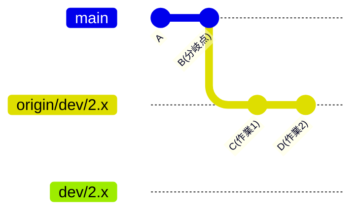
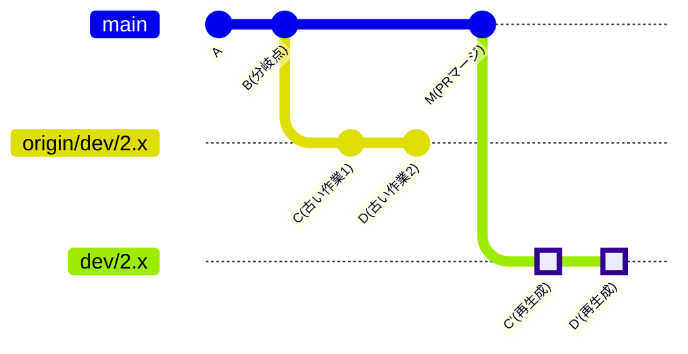
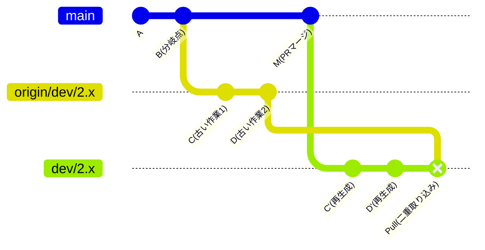
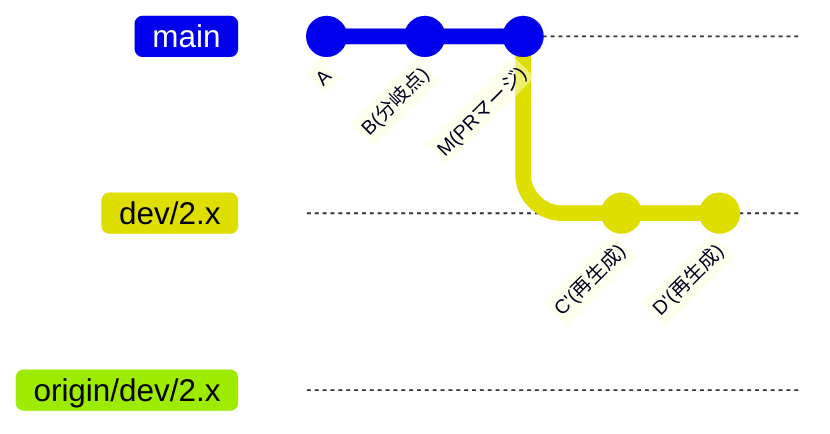
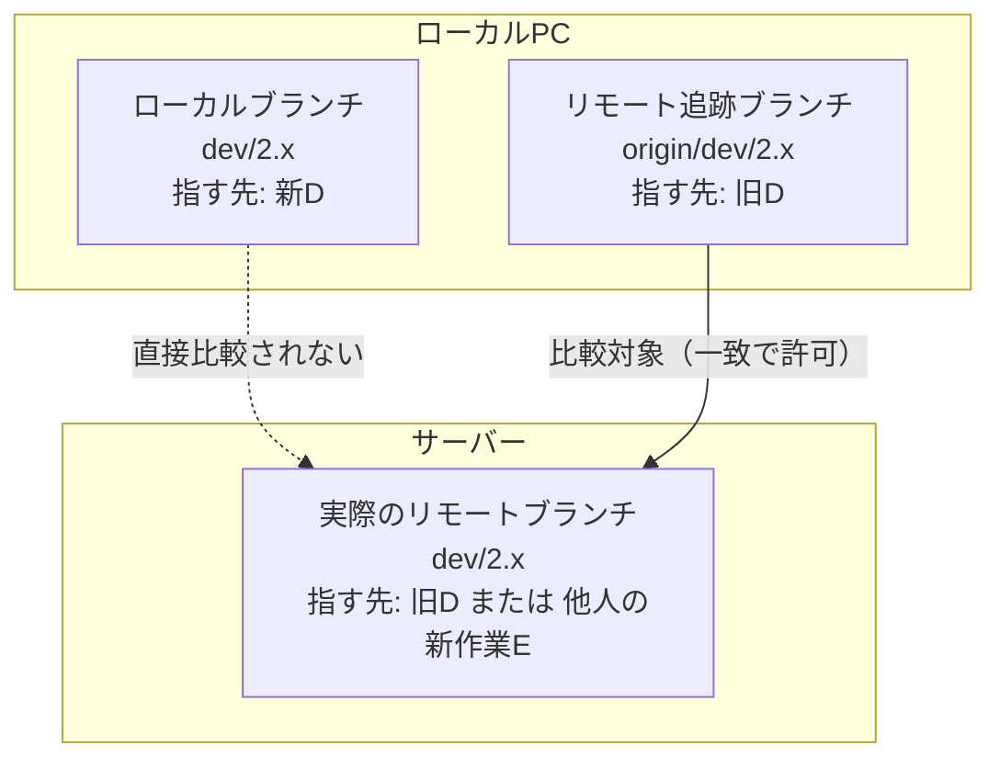

# git rebaseで「diverged」が発生する理由と、--force-with-leaseによる安全な上書きの仕組み

## git rebaseで「diverged」と怒られた。

チーム開発において、`main` ブランチの最新の変更を取り込む際、コミット履歴を一直線に保つ目的で `git merge` ではなく `git rebase` を採用するケースは多い。

しかし、作業ブランチで `git rebase` を実行した直後、`git status` で確認するとローカルとリモートの履歴が「diverged（枝分かれ）」状態になり、警告が出ることがある。

本記事では、この現象が発生する論理的な理由と、その際の正しい対処法である `git push --force-with-lease` の内部的な仕組みについて、図解を交えて整理する。

## 1. 事象：リベース時のスキップと「diverged」警告

作業ブランチ（例: `dev/2.x`）において、最新の `main` を元にリベースを実行した際、以下のようなログが出力されることがある。

```bash
$ git rebase main
warning: skipped previously applied commit aa23898
warning: skipped previously applied commit 2cc1f69
hint: use --reapply-cherry-picks to include skipped commits
hint: Disable this message with "git config advice.skippedCherryPicks false"

```

上記は特定のコミットが「スキップされた」ことを示している。続いて `git status` を実行すると、以下のメッセージが表示される。

```bash
$ git status
On branch dev/2.x
Your branch and 'origin/dev/2.x' have diverged,
and have 9 and 5 different commits each, respectively.
  (use "git pull" to merge the remote branch into yours)

nothing to commit, working tree clean

```

「ローカルとリモートで9個と5個のコミットが枝分かれ（diverged）している」という状態通知と同時に、`git pull` を実行するようサジェストされる。しかし、**ここでサジェストに従って `git pull` を実行してはいけない。**

なぜこの状態になるのか、順を追って確認する。

## 2. 【図解】コミットのスキップと分岐が発生するメカニズム

この挙動はエラーではなく、Gitの仕様に基づく正常な処理結果である。履歴の変遷を4つのフェーズに分けて図解する。

### フェーズ1：リベース前の状態

リベースを実行する前は、ローカルの `dev/2.x` と、リモートを追跡する `origin/dev/2.x` は同じコミット（D）を指している。



### フェーズ2：コミットのスキップと再生成（divergedの発生）

最新の `main` を取得し、`git rebase main` を実行する。
この時、自身の作業ブランチのコミット（例: `C`）と同等の変更が、既に別ルート（他のPRなど）で `main` にマージされていた場合、Gitは重複を防ぐために該当コミットの適用をスキップする。これが `warning: skipped previously applied commit` の理由である。

残りのコミット（例: `D`）は、新しい土台の上に「新しいコミット（D'）」として再生成される。



この図が示す通り、ローカルの `dev/2.x` は新しく再生成されたコミット群を参照し始めたが、リモートを追跡する `origin/dev/2.x` はリベース前の古いコミットを参照したままである。
Gitはこの状態を比較し、共通の祖先（B）から「枝分かれ（diverged）している」と判定している。

## 3. なぜ `git pull` を実行してはいけないのか（アンチパターン）

ターミナルのサジェスト通りに `git pull` を実行すると、手元の新しい履歴（D'）に対して、リモートに残っている古い履歴（C, D）がマージされてしまう。



結果として、実質的に同じ変更内容が二重に記録され、本来一直線に整理したかったコミット履歴が著しく複雑化する。
リベースを行った後は、手元の新しい履歴で**リモートの古い履歴を強制的に上書きする**のが正しいアプローチとなる。

## 4. 対処法：--force-with-lease による安全な上書き

リモートの履歴を上書きするためには、以下のコマンドを実行する。

```bash
$ git push --force-with-lease origin dev/2.x

```

コマンド実行後、リモートの `origin/dev/2.x` のポインタが強制的に移動し、ローカルの `dev/2.x` と再び一致する。古いコミット（C, D）はどのブランチからも参照されなくなり、履歴から切り離される。



単なる `--force` オプションは、リモートの最新状態を確認せずに問答無用で上書きするため、他の開発者が追加したコミットを意図せず消失させるリスクがある。
一方 `--force-with-lease` は、「自分が最後に取得したリモートの状態から、更新が加わっていない場合のみ」上書きを許可する安全なオプションである。実務においては常にこちらを使用することが推奨される。

## 5. コミットハッシュが異なる状態で、なぜ「安全な比較」が成立するのか

ここで一つの技術的な疑問が生じる。
「Gitのコミットはスナップショットであり、リベースによってハッシュ値が変わる以上、ローカルの先端（D'）とリモートの先端（D）を比較しても常に不一致となり、`--force-with-lease` は機能しないのではないか」という点だ。

この疑問への答えは、Gitがプッシュ時の比較に用いている「リモート追跡ブランチ」の存在にある。
Gitはローカル環境内に、「最後にリモートと通信した時の状態」を記録するポインタ（`origin/dev/2.x`）を保持している。



リベースを実行してローカルブランチ（`dev/2.x`）が新しいコミット（`D'`）を指すようになっても、リモート追跡ブランチ（`origin/dev/2.x`）は通信が行われるまで古いコミット（`D`）を指したまま維持される。

`--force-with-lease` 実行時、Gitはローカルブランチではなく、以下の2つを比較する。

1. **ローカルにあるリモート追跡ブランチ**（例: 旧D）
2. **実際のリモートブランチ**（例: 旧D）

この両者が一致していれば、「自分が把握している状態から、誰もリモートに変更を加えていない」と判断し、手元の新しいコミット（D'）での上書きを実行する。もし他の開発者がコミットを追加していた場合は不一致となり、プッシュは拒否される。

このように、Gitは「リモート追跡ブランチ」という仕組みを用いることで、リベースによるローカルの破壊的変更と、リモートとの安全な同期を両立している。

## まとめ

* `skipped previously applied commit` は、既に `main` に存在する変更をGitが検知し、重複を回避した正常なログである。
* リベース後の `diverged` 状態は、仕様上発生するものでありエラーではない。
* サジェストに従って `git pull` を実行すると履歴が重複するため、避けるべきである。
* リモートの履歴を正しく更新するためには `git push --force-with-lease` を使用する。
* `--force-with-lease` の安全な比較は、「リモート追跡ブランチ」の仕組みによって担保されている。

