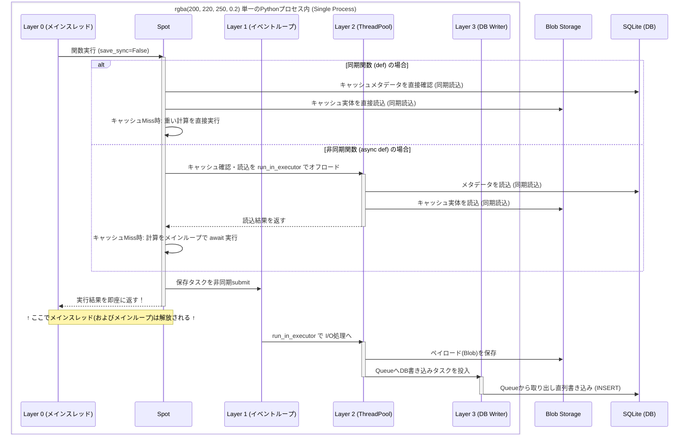
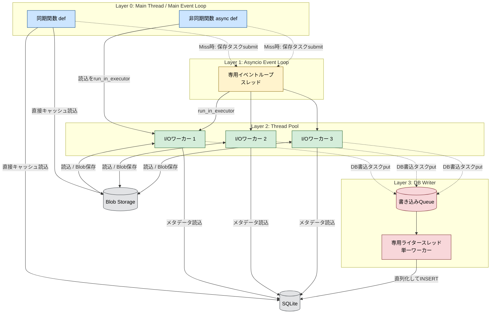

# キャッシュ保存によるメインスレッドのブロック

データサイエンスのパイプラインやLLMを活用したアプリケーションにおいて、API料金がかかったり処理が重かったりする関数の実行結果をキャッシュ（永続化）するケースは多い。

しかし、巨大なデータフレームのシリアライズや、クラウドストレージ（S3など）へのアップロードを同期的に行うと、キャッシュの保存処理自体がボトルネックとなり、メインスレッドの実行（APIのレスポンスなど）を著しくブロックしてしまう。

OSSのキャッシュライブラリである `beautyspot` では、計算が完了した瞬間に結果を呼び出し元へ返し、裏側でデータを保存する「ノンブロッキング永続化（`save_sync=False`）」を採用している。
本記事では、単純なマルチスレッド化では解決できないデータベースの制約と、PythonのGIL（グローバルインタプリタロック）やイベントループの特性を乗り越えるための「3層非同期アーキテクチャ」の内部機構について、図解を交えて整理する。

# 1. ノンブロッキング永続化を支える3層構造

バックグラウンドで処理を行う際、直感的には `ThreadPoolExecutor` にタスクを投げる（`submit`）だけで済むように思える。しかし、`beautyspot` は以下の3つのレイヤーで非同期処理を厳密に分離している。

1. **Layer 1:** 専用スレッド上の `asyncio` イベントループ
2. **Layer 2:** I/Oバウンド用の `ThreadPoolExecutor`
3. **Layer 3:** DB書き込み専用スレッドと直列化キュー

> **補足: すべて単一プロセスで完結**
> 本アーキテクチャは、RedisやCeleryのような外部のワーカープロセスを立ち上げるものではなく、すべて単一のPythonプロセス内のマルチスレッドとして動作する。プロセスの通信オーバーヘッドがゼロである反面、Python特有の制約とどう協調するかが設計の鍵となる。

このアーキテクチャの「時間的な処理の流れ（シーケンス）」と「空間的な構造（フロー）」を対応させた図が以下の2つである。

## 時間軸で見る処理の流れ（シーケンス図）

非同期環境下では徹底してメインループをブロックしないよう、キャッシュの確認（DBやStorageからの読込）のI/Oすらもスレッドプールに逃がしつつ、保存自体はバックグラウンドの専用ループに委譲する。



## 空間的なアーキテクチャ構造（フローチャート）



# 2. なぜ単純なスレッドプールでは駄目なのか（SQLiteのロック問題）

`asyncio` のイベントループは、シングルスレッド上で協調的にタスクを切り替えることで非同期処理を実現している。
しかし、`beautyspot` が扱う巨大なデータフレームのシリアライズ（CPUバウンド）や、S3等へのBlob保存（同期的なI/Oバウンド）は、標準ではブロッキング処理である。
これをイベントループ上で直接実行してしまうと、その重い処理が終わるまでの間、イベントループ全体がフリーズしてしまう。イベントループはあくまで「超軽量なタスクの受付係兼オーケストレーター」として常に即答できる状態を保っておく必要がある。

シリアライズやBlobストレージへの保存は、複数スレッドで並列に実行しても問題ない（Layer 2 の役割）。
一方で、SQLiteへの書き込みは並列に行うと `database is locked` エラーになるため直列化が必要である（Layer 3 の役割）。

SQLiteにおいてWAL（Write-Ahead Logging）モードを有効にしても、書き込み操作は本質的に単一のライターに制限される。そのため、`ThreadPoolExecutor` の複数ワーカーから同時に `INSERT` を試みると、高い確率でロックエラーが発生する。
この問題を回避するため、`beautyspot` ではコネクションプールを使用せず、データベースへの書き込み操作そのものをキューイングし、単一のスレッドで直列化（シリアライズ）して実行している。

# 3. 同時キャッシュミス（Thundering Herd現象）とスレッド枯渇の回避

並行処理を導入したキャッシュシステムにおいて、もう一つ致命的となるのが「Thundering Herd（群れをなして押し寄せる）」問題である。キャッシュが有効期限切れになった直後、複数のスレッドや非同期タスクが同時に同じ関数を呼び出すと、全員が「キャッシュミス」と判定して重い処理を一斉に実行してしまう。

これを防ぐためには「最初に到達した実行者以外は待機する」ロック機構が必要になるが、ここでも同期と非同期で待機戦略を変えなければならない。

* **同期関数（`def`）の場合:**
後続のスレッドは `threading.Event().wait()` を呼び出して、先行スレッドの処理完了をノンブロッキングで待機する。
* **非同期関数（`async def`）の場合（スレッド枯渇対策）:**
もしここで「イベントの待機処理」自体を `run_in_executor` でスレッドプールに投げてしまうと、数千の同時リクエストが来た瞬間にスレッドプールの全ワーカーが「待機」で埋め尽くされ、システム全体がデッドロックに似た状態（スレッド枯渇）に陥ってしまう。

そのため `beautyspot` の最新アーキテクチャでは、非同期タスクはスレッドを1つも消費しない設計を採用している。
後続の非同期タスクは、イベントループ内で動的に `asyncio.Future` を生成してリストに登録し、そのまま `await` する。そして先行する実行スレッドが完了した際、`call_soon_threadsafe` を介してこれらのFutureに結果を一斉に分配（ブロードキャスト）する。これにより、どれだけ大量のThundering Herdが発生しても、スレッドプールを一切消費せずに安全に待機・解決できる。

# 4. シリアライズにおけるロック競合の排除（No-GILを見据えた設計）

I/Oを別スレッドに逃がしても、キャッシュライブラリには「巨大なオブジェクトツリーのシリアライズ（CPUバウンド）」というもう一つのボトルネックが存在する。

Pydanticモデルのような複雑なカスタム型を MessagePack 等でシリアライズする際、内部で「この型はどうエンコードするか？」という型レジストリ（辞書）をルックアップする必要がある。マルチスレッド環境下でこの共有辞書を `Lock` で保護してしまうと、複数スレッドで巨大な配列をシリアライズした際に強烈なロック待ちの渋滞が発生する。
PythonのGIL（グローバルインタプリタロック）が外れる未来（Free-Threading）を見据えると、クリティカルパスの排他ロックは極力避けるべきだ。

`beautyspot` のシリアライザは、以下の2つのアプローチでこのロックを完全に排除（Lock-free化）している。

1. **Copy-on-Write (CoW) による型レジストリ:**
型の登録（書き込み）が発生した時のみ、辞書のコピーを作成して新しい型を追加し、インスタンスの参照をアトミックに差し替える。これにより、高頻度で発生するシリアライズ時の「型の読み取り」は一切ロック不要となる。
2. **スレッドローカルなLRUキャッシュ:**
動的に解決されたクラスの継承関係（MRO）をキャッシュする際、共有の辞書を使うのではなく、`threading.local()` を用いて「スレッドごとに独立したLRUキャッシュ」を持たせている。

この設計により、複数のワーカーが同時に巨大なデータをシリアライズしても、スレッド間の干渉が物理的に発生せず、極めて高い並列スループットを叩き出すことができる。

# 5. 永久ハングを防ぐポーリングと、結果整合性を守る「ステートマシン」

バックグラウンド処理を安全に終了させる際、キューに残っているタスクを全て消化するまで待機（ドレイン）する `flush()` 処理が必要になる。ここで単純に `Queue.join()` や無期限の `Event.wait()` を使ってしまうと、万が一裏のライタースレッドが予期せぬエラーで突然死（クラッシュ）した場合、メインスレッドは永遠にフリーズ（デッドロック）してしまう。
これを防ぐため、あえて「0.5秒のポーリング」による待機ループを実装し、ポーリングのたびに裏のスレッドが生きているか死活監視を行うフェイルファストな設計としている。

さらに、「タイムアウトが発生した際のキャンセル処理」にもデータベースを守るための工夫がある。
バックグラウンドのDB書き込みタスクがタイムアウトした場合、安易にタスクを破棄してはいけない。もしそのタスクが既にキューから取り出され、SQLite上で `INSERT` トランザクションを実行中（RUNNING状態）であった場合、Python側から強制的に処理を剥がすとデータベースの破損や不整合を招く恐れがある。

そのため内部のタスクにステートマシン（状態遷移）を実装している。
タスクが待機中（PENDING）であれば安全にキューから取り消すが、既に実行中（RUNNING）であれば「キャンセル要求を無視してバックグラウンドで最後まで書き切る」というフェイルセーフを設けている。呼び出し元には `TimeoutError` を返すが、裏側では遅延してキャッシュが永続化される「結果整合性（Eventual Consistency）」を意図的に許容することで、システムの堅牢性を守っている。

# 6. GC（ガベージコレクション）時のデータロスト防止と強参照トラッキング

非同期タスクを投げて放置する設計で一番怖いのは、「メインスレッドの終了時」や「インスタンスがスコープを抜けてガベージコレクション（GC）された時」に、未完了の保存タスクが強制キャンセルされてデータが消えることである。

これを防ぐため、2つのアプローチをとっている。

1. **強参照セットによるタスク追跡:**
実行中の `Future` をあえて `WeakSet` ではなく通常の `set` で強参照保持する。これにより、ユーザーコード側で参照が切れてもタスクがGCされず、完了まで確実に生存し続ける耐久性を担保している。
2. **ライフサイクルに応じたシャットダウン戦略:**
* アプリケーション終了時（`atexit`）は、メインスレッドをブロックしてでも `flush()` を行い未保存のデータを救う。
* 一方、GCによる破棄時（`weakref.finalize`）は、メインスレッドをフリーズさせないために即座にスレッドを切り離し、バックグラウンドでの自発的な完了（ゾンビスレッド化）に委ねる。


# 7. メインスレッドを1ミリ秒も止めない「確率的 Auto-Eviction」

キャッシュの有効期限切れデータの掃除（エビクション）をどう行うかも重要なテーマだ。リクエストのたびにDB全体を走査するとレイテンシが悪化するため、確率に基づくトリガー (`eviction_rate`) を採用している。

さらに、裏で掃除タスクが走っている間に別のリクエストが来て重複実行されないよう、ノンブロッキングロック (`acquire(blocking=False)`) を使用している。ロックが取れなければ待つのではなく「即座にリターンする」ことで、メインスレッドの応答性を極限まで高めている。

# 8. バックグラウンドエラーの握りつぶし（アンチパターン）と監視機構

非同期でキャッシュを保存するアプローチには、運用上の大きな罠がある。それは、シリアライズの失敗やストレージへの通信エラーが発生した際、メインスレッドはそれに気付かず正常終了してしまう（サイレントフェイル）という点である。

これを防ぐため、明示的なエラーハンドリングの口である `on_background_error` コールバックを用意している。

```python
def my_error_handler(err: Exception, context: SaveErrorContext):
    # DatadogやSentry等の監視ツールへ、型安全なコンテキストと共に通知する
    sentry_sdk.capture_exception(
        err,
        contexts={"cache_task": {"func": context.func_name, "key": context.cache_key}}
    )

spot = Spot(..., on_background_error=my_error_handler)

```

失敗した関数名やキャッシュキーを保持した `SaveErrorContext` オブジェクトを外部へ渡すことで、メインの処理フローを阻害することなく、オブザーバビリティ（可観測性）を担保している。

# まとめ

* キャッシュ保存によるI/O待ちを防ぐため、`asyncio` と `ThreadPool` を組み合わせた3層のバックグラウンド処理が有効である。
* マルチスレッド環境での Thundering Herd 対策は必須だが、非同期タスクではスレッドプールを枯渇させない `asyncio.Future` を用いたネイティブな待機機構が必要である。
* シリアライズのような重いCPUバウンド処理において、Copy-on-Write (CoW) やスレッドローカルを用いた「ロックフリー設計」は、並列スループットを劇的に向上させる。
* SQLiteへの並行書き込みによるエラーを防ぐには、キューを用いた直列化が安全である。また、タイムアウト時は「結果整合性」を許容するステートマシン設計でDBを守るべきである。
* バックグラウンド処理のサイレントフェイルを防ぐため、エラーコンテキストを外部の監視システムへ委譲するコールバック機構を設けるべきである。

